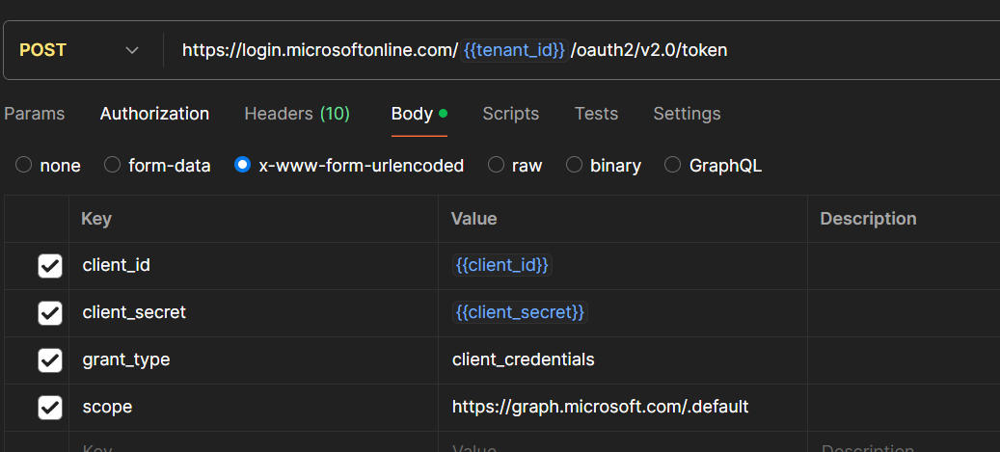

### Step 1

1. Register an app in Azure with the following permissions:
   - `Files.Read.All`
   - `Files.ReadWrite.All`
   - `Sites.Read.All`
   - `Sites.ReadWrite.All`
   - `User.Read`

2. Obtain the following values from the app registration:
   - `client_id`
   - `tenant_id`
   - `client_secret`

3. Get an access token by sending a `POST` request to:
   ```
   https://login.microsoftonline.com/{{tenant_id}}/oauth2/v2.0/token
   ```
   Use the following body:
   

4. Retrieve the `site_id` by sending a request to:
   ```
   https://graph.microsoft.com/v1.0/sites?search={{site_name}}
   ```
   Use the access token obtained in the previous step for authentication.

5. Retrieve the `drive_id` by sending a request to:
   ```
   https://graph.microsoft.com/v1.0/sites/{{site_id}}/drives
   ```
   Use the `site_id` from the previous step and the access token for authentication.